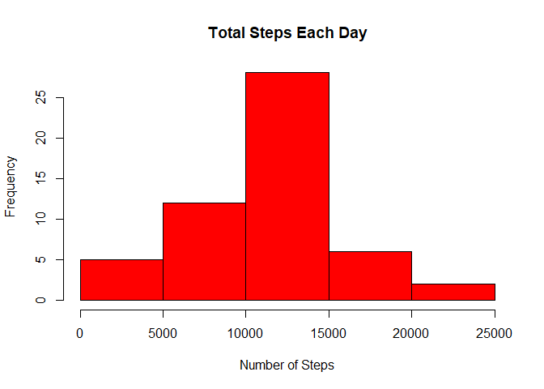
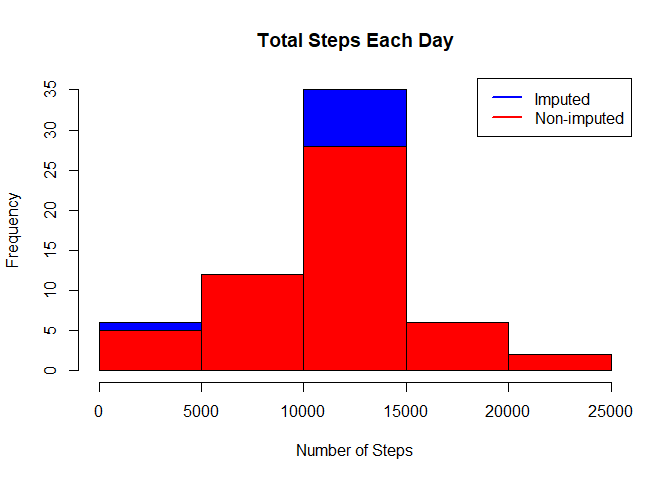
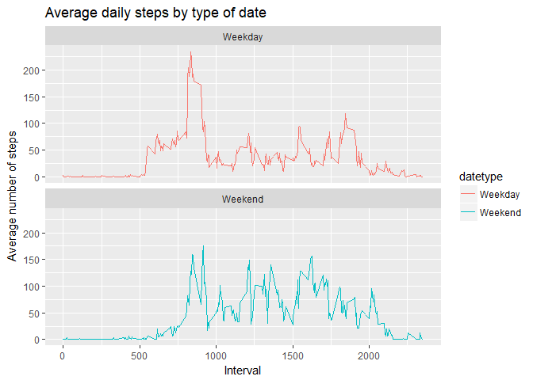

## Introduction
It is now possible to collect a large amount of data about personal movement using activity monitoring devices such as a [Fitbit](http://www.fitbit.com), [Nike Fuelband](http://www.nike.com/us/en_us/c/nikeplus-fuelband), or [Jawbone Up](https://jawbone.com/up). These type of devices are part of the "quantified self" movement -- a group of enthusiasts who take measurements about themselves regularly to improve their health, to find patterns in their behavior, or because they are tech geeks. But these data remain under-utilized both because the raw data are hard to obtain and there is a lack of statistical methods and software for processing and interpreting the data.

This assignment makes use of data from a personal activity monitoring device. This device collects data at 5 minute intervals through out the day. The data consists of two months of data from an anonymous individual collected during the months of October and November, 2012 and include the number of steps taken in 5 minute intervals each day.

### Data
The data for this assignment can be downloaded from the course web site:

* Dataset: [Activity monitoring data](https://d396qusza40orc.cloudfront.net/repdata%2Fdata%2Factivity.zip) [52K]

The variables included in this dataset are:

* **steps**: Number of steps taking in a 5-minute interval (missing values are coded as `NA`)

* **date**: The date on which the measurement was taken in YYYY-MM-DD format

* **interval**: Identifier for the 5-minute interval in which measurement was taken

The dataset is stored in a comma-separated-value (CSV) file and there are a total of 17,568 observations in this dataset.

## Loading and preprocessing the data
Let's load the data into the 'activity' data frame. Make sure the data is unzipped and placed into the current working directory.


```r
activity <- read.csv("activity.csv")
```
Let's see the data:


```r
str(activity)
```

```
## 'data.frame':	17568 obs. of  3 variables:
##  $ steps   : int  NA NA NA NA NA NA NA NA NA NA ...
##  $ date    : Factor w/ 61 levels "2012-10-01","2012-10-02",..: 1 1 1 1 1 1 1 1 1 1 ...
##  $ interval: int  0 5 10 15 20 25 30 35 40 45 ...
```

## What is mean total number of steps taken per day?

Calculating sum of steps by days and creating gistogram:

```r
steps_day <- aggregate(steps ~ date, activity, sum)
hist(steps_day$steps, main = paste("Total Steps Each Day"), col="red", xlab="Number of Steps")
```

<!-- -->

Calculating mean and median:

```r
steps_mean <- mean(steps_day$steps)
steps_median <- median(steps_day$steps)
print(steps_mean)
```

```
## [1] 10766.19
```

```r
print(steps_median)
```

```
## [1] 10765
```

The **mean**=10766.19 and the **median**=10765.  
And the summary of steps:

```r
summary(steps_day)
```

```
##          date        steps      
##  2012-10-02: 1   Min.   :   41  
##  2012-10-03: 1   1st Qu.: 8841  
##  2012-10-04: 1   Median :10765  
##  2012-10-05: 1   Mean   :10766  
##  2012-10-06: 1   3rd Qu.:13294  
##  2012-10-07: 1   Max.   :21194  
##  (Other)   :47
```

## What is the average daily activity pattern?
Let’s create a time series plot of the 5-minute interval (x-axis) and the average number of steps taken, averaged across all days (y-axis).

```r
steps_interval <- aggregate(steps ~ interval, activity, mean)

plot(steps_interval$interval,steps_interval$steps, type="l", xlab="Interval", ylab="Number of Steps",main="Average Number of Steps per Day by Interval")
```

<!-- -->

Now, let’s see which 5-minute interval contains the maximum number of steps

```r
max_interval <- steps_interval[which.max(steps_interval$steps),1]
print(max_interval)
```

```
## [1] 835
```
The 5-minute interval, on average across all the days in the data set, containing the maximum number of steps is 835.

## Imputing missing values
 
Missing values are imputed by inserting the average for each interval. Thus, if interval 10 was missing on 10-02-2012, the average for that interval for all days (0.1320755), replaced the NA:


```r
missing <- sum(!complete.cases(activity))
impute <- transform(activity, steps = ifelse(is.na(activity$steps), steps_interval$steps[match(activity$interval, steps_interval$interval)], activity$steps))
```

Zeroes are imputed for 10-01-2012 because it was the first day and would have been over 9,000 steps higher than the following day, which had only 126 steps. NAs are assumed to be zeros to fit the rising trend of the data:

```r
impute[as.character(impute$date) == "2012-10-01", 1] <- 0
```

Recounting total steps by day and recreating the histogram:

```r
steps_day_1 <- aggregate(steps ~ date, impute, sum)
hist(steps_day_1$steps, main = paste("Total Steps Each Day"), col="blue", xlab="Number of Steps")

# creating the histogram to show the difference 
hist(steps_day$steps, main = paste("Total Steps Each Day"), col="red", xlab="Number of Steps", add=T)
legend("topright", c("Imputed", "Non-imputed"), col=c("blue", "red"), lwd=2)
```

<!-- -->

Calculating new mean and median for imputed data: 

```r
steps_mean_1 <- mean(steps_day_1$steps)
steps_median_1 <- median(steps_day_1$steps)
```

Calculating the difference between imputed and non-imputed data:

```r
steps_mean_diff <- steps_mean_1 - steps_mean
steps_median_diff <- steps_median_1 - steps_median
```

Calculating total difference:

```r
total_diff <- sum(steps_day_1$steps) - sum(steps_day$steps)
print(steps_mean_1) 
```

```
## [1] 10589.69
```

```r
print(steps_median_1)
```

```
## [1] 10766.19
```

```r
print(steps_mean_diff)
```

```
## [1] -176.4949
```

```r
print(steps_median_diff)
```

```
## [1] 1.188679
```

```r
print(total_diff)
```

```
## [1] 75363.32
```
* The imputed data mean is 10589.69
* The imputed data median is 10766.19
* The difference between the non-imputed mean and imputed mean is -176.4949
* The difference between the non-imputed mean and imputed mean is 1.188679
* The difference between total number of steps between imputed and non-imputed data is 75363.32. Thus, there were 75363.32 more steps in the imputed data.


## Are there differences in activity patterns between weekdays and weekends?
Comparing the number of steps between the week and weekend.

Creating a new factor variable with levels "weekday" and "weekend" for weekday and weekend respectively.  

```r
library(ggplot2)

activity$date <- as.Date(strptime(activity$date, format="%Y-%m-%d"))
activity$datetype <- sapply(activity$date, function(x) {
        if (weekdays(x) == "Saturday" | weekdays(x) =="Sunday") 
                {y <- "Weekend"} else 
                {y <- "Weekday"}
                y
        })
```

Make a panel plot containing a time series plot of the 5-minute interval (x-axis) and the average number of steps taken, averaged across all weekday days or weekend days (y-axis):


```r
activity_by_date <- aggregate(steps~interval + datetype, activity, mean, na.rm = TRUE)
plot<- ggplot(activity_by_date, aes(x = interval , y = steps, color = datetype)) +
       geom_line() +
       labs(title = "Average daily steps by type of date", x = "Interval", y = "Average number of steps") +
       facet_wrap(~datetype, ncol = 1, nrow=2)
print(plot)
```

<!-- -->

There is a higher peak earlier on weekdays, and more overall activity on weekends.
